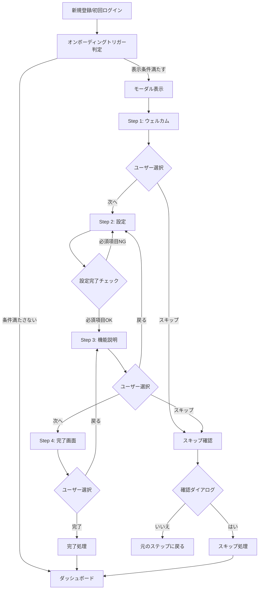

# 新規ユーザーオンボーディング機能 UI/UXデザイン設計書

## 🎨 1. 全体デザインコンセプト

**テーマ：** 「やさしく導く学習パートナー」
- **親しみやすさ**：堅苦しくない、フレンドリーな印象
- **分かりやすさ**：視覚的に直感的な操作が可能
- **継続性**：既存UIとの一貫性を保つ

## 🎨 2. カラーパレット（既存システム準拠）

```css
/* メインカラー */
--color-muted-blue: #5B7C99         /* プライマリブルー */  
--color-muted-blue-dark: #4A6B87    /* ダークブルー */
--color-muted-blue-light: #E8F2F7   /* ライトブルー */

/* ステータスカラー */
--color-muted-green: #7BA05B        /* 成功・完了 */
--color-muted-green-light: #E8F5E8  /* 成功背景 */
--color-muted-green-dark: #5A7A43   /* 成功テキスト */

--color-muted-pink: #C85A5A         /* エラー・警告 */
--color-muted-pink-light: #F5E8E8   /* エラー背景 */
--color-muted-pink-dark: #A43A3A    /* エラーテキスト */

/* ニュートラルカラー */
--color-muted-gray-dark: #6B7280    /* テキスト */
--color-muted-gray-light: #F3F4F6   /* 境界線 */
--color-muted-white: #FDFEFE        /* 背景 */
```

## 📐 3. レイアウト構造

### 3.1 モーダル基本構造
```
┌─────────────────────────────────────────┐
│ ░░░░░░░░░░ グレーアウト背景 ░░░░░░░░░░░░░ │
│ ░                                     ░ │  
│ ░  ┌─────────────────────────────┐    ░ │
│ ░  │         モーダル本体         │    ░ │
│ ░  │  ┌─────────────────────┐    │    ░ │
│ ░  │  │     ヘッダー部分      │    │    ░ │
│ ░  │  │  ✕ 📚 ステップ 1/4   │    │    ░ │
│ ░  │  └─────────────────────┘    │    ░ │
│ ░  │  ┌─────────────────────┐    │    ░ │
│ ░  │  │   プログレスバー     │    │    ░ │
│ ░  │  │ ████████░░░░░░░░░░░░ │    │    ░ │
│ ░  │  └─────────────────────┘    │    ░ │
│ ░  │  ┌─────────────────────┐    │    ░ │
│ ░  │  │                     │    │    ░ │
│ ░  │  │    コンテンツ本体    │    │    ░ │
│ ░  │  │                     │    │    ░ │
│ ░  │  └─────────────────────┘    │    ░ │
│ ░  │  ┌─────────────────────┐    │    ░ │
│ ░  │  │ [戻る] [スキップ] [次へ] │    │    ░ │
│ ░  │  └─────────────────────┘    │    ░ │
│ ░  └─────────────────────────────┘    ░ │
│ ░                                     ░ │
│ ░░░░░░░░░░░░░░░░░░░░░░░░░░░░░░░░░░░░░░░ │
└─────────────────────────────────────────┘
```

### 3.2 レスポンシブ対応
- **デスクトップ（≥1024px）**：
  - モーダル幅: 600px
  - 最大高さ: 90vh
  - 中央配置

- **タブレット（768px-1023px）**：
  - モーダル幅: 90vw
  - パディング: 16px
  - フォントサイズ調整

- **モバイル（≤767px）**：
  - モーダル幅: 95vw
  - フルハイト使用
  - タッチフレンドリーなボタンサイズ

### 3.3 Z-Index管理
```css
.onboarding-modal {
  z-index: 1000; /* ベースレイヤー */
}

.onboarding-backdrop {
  z-index: 999; /* 背景グレーアウト */
}

.other-modals {
  z-index: 1100+; /* 他のモーダルとの競合回避 */
}
```

## 🎯 4. 各ステップ詳細設計

### Step 1: ウェルカム画面
```
┌───────────────────────────────────────┐
│ ✕                     ステップ 1/4     │
├───────────────────────────────────────┤
│ ████░░░░░░░░░░░░░░░░░░░░░░░░░░░░░░░░    │ プログレス25%
├───────────────────────────────────────┤
│                                       │
│                  📚                   │
│                                       │
│         すたログへようこそ！           │
│                                       │
│   📊 学習時間を可視化して、継続的な    │
│      学習習慣を身につけましょう        │
│                                       │
│   🎯 資格試験に向けた効率的な学習を    │
│      サポートします                   │
│                                       │
│   ✨ 今すぐ始めて、学習の成果を        │
│      実感してみてください！            │
│                                       │
├───────────────────────────────────────┤
│           [スキップ]      [次へ]       │
└───────────────────────────────────────┘
```

### Step 2: インタラクティブ初期設定
```
┌───────────────────────────────────────┐
│ ✕                     ステップ 2/4     │  
├───────────────────────────────────────┤
│ ████████░░░░░░░░░░░░░░░░░░░░░░░░░░░░    │ プログレス50%
├───────────────────────────────────────┤
│              ⚙️ 初期設定               │
│                                       │
│   📝 試験種別を選択してください        │
│   ┌─────────────────────────────┐     │
│   │ [JSTQB] [AWS] [ITパスポート] │     │
│   │ [その他]                   │     │
│   └─────────────────────────────┘     │
│                                       │
│   📚 学習分野を選択してください        │
│   ┌─────────────────────────────┐     │
│   │ ☑ テスト設計技法             │     │
│   │ ☐ ソフトウェア品質          │     │
│   │ ☐ テスト管理                │     │
│   └─────────────────────────────┘     │
│                                       │
├───────────────────────────────────────┤
│      [戻る]     [スキップ]    [次へ]    │
└───────────────────────────────────────┘
```

### Step 3: 基本機能説明
```
┌───────────────────────────────────────┐
│ ✕                     ステップ 3/4     │
├───────────────────────────────────────┤
│ ████████████░░░░░░░░░░░░░░░░░░░░░░░░    │ プログレス75%
├───────────────────────────────────────┤
│            🚀 基本機能紹介             │
│                                       │
│   ⏰ 時間計測機能                      │
│   └─ 学習時間を自動で記録します        │
│                                       │
│   🍅 ポモドーロタイマー                │
│   └─ 25分集中→5分休憩で効率UP!       │
│                                       │
│   📊 学習統計                         │
│   └─ 進捗グラフで成果を可視化          │
│                                       │
│   📚 学習履歴                         │
│   └─ 過去の学習内容を振り返り          │
│                                       │
├───────────────────────────────────────┤
│      [戻る]     [スキップ]    [次へ]    │
└───────────────────────────────────────┘
```

### Step 4: 完了・設定画面への誘導
```
┌───────────────────────────────────────┐
│ ✕                     ステップ 4/4     │
├───────────────────────────────────────┤
│ ████████████████████████████████████  │ プログレス100%
├───────────────────────────────────────┤
│               🎉 準備完了！            │
│                                       │
│   設定は「設定」タブからいつでも        │
│   変更できます                        │
│                                       │
│   ⚙️ 設定画面で行えること：            │  
│   • 試験種別・学習分野の追加/変更      │
│   • 学習目標の調整                    │
│   • 通知設定の変更                    │
│   • このガイドの再表示                │
│                                       │
│   さあ、学習を始めましょう！           │
│                                       │
├───────────────────────────────────────┤
│      [戻る]              [完了]        │
└───────────────────────────────────────┘
```

## 🎨 5. インタラクション設計

### 5.1 アニメーション仕様
```css
/* モーダル表示アニメーション */
.onboarding-modal-enter-active {
  transition: all 0.3s ease-out;
}

.onboarding-modal-enter-from {
  opacity: 0;
  transform: scale(0.9) translateY(-20px);
}

.onboarding-modal-enter-to {
  opacity: 1;
  transform: scale(1) translateY(0);
}

/* ステップ切り替えアニメーション */
.step-slide-enter-active,
.step-slide-leave-active {
  transition: all 0.2s ease;
}

.step-slide-enter-from {
  opacity: 0;
  transform: translateX(20px);
}

.step-slide-leave-to {
  opacity: 0;
  transform: translateX(-20px);
}

/* ボタンホバーエフェクト */
.onboarding-button {
  transition: all 0.1s ease;
}

.onboarding-button:hover {
  transform: translateY(-1px);
  box-shadow: 0 2px 4px rgba(0, 0, 0, 0.1);
}
```

### 5.2 操作フロー図


### 5.3 スワイプジェスチャー（モバイル）
```javascript
// タッチスワイプ対応
const swipeThreshold = 50; // px
let startX = 0;

// タッチ開始
onTouchStart(e) {
  startX = e.touches[0].clientX;
}

// タッチ終了
onTouchEnd(e) {
  const endX = e.changedTouches[0].clientX;
  const diffX = startX - endX;
  
  if (Math.abs(diffX) > swipeThreshold) {
    if (diffX > 0 && this.canProceed) {
      // 左スワイプ → 次へ
      this.nextStep();
    } else if (diffX < 0 && this.canGoBack) {
      // 右スワイプ → 戻る
      this.prevStep();
    }
  }
}
```

## 📱 6. モバイル対応設計

### 6.1 タッチインターフェース
- **ボタンサイズ**：最小44px × 44px（Apple推奨）
- **タップエリア**：余裕を持った48px × 48px
- **スワイプ対応**：左右スワイプでステップ切り替え

### 6.2 フォント・レイアウト調整
```css
/* デスクトップ */
@media (min-width: 1024px) {
  .onboarding-title { font-size: 24px; }
  .onboarding-body { font-size: 16px; line-height: 1.6; }
  .onboarding-button { padding: 12px 24px; }
}

/* タブレット */
@media (min-width: 768px) and (max-width: 1023px) {
  .onboarding-title { font-size: 22px; }
  .onboarding-body { font-size: 16px; line-height: 1.7; }
  .onboarding-button { padding: 14px 28px; }
}

/* モバイル */
@media (max-width: 767px) {
  .onboarding-title { font-size: 20px; }
  .onboarding-body { font-size: 16px; line-height: 1.8; }
  .onboarding-button { 
    padding: 16px 32px; 
    min-height: 48px;
    font-size: 16px;
  }
  
  .onboarding-modal {
    margin: 8px;
    border-radius: 12px;
  }
}
```

## ♿ 7. アクセシビリティ設計

### 7.1 キーボードナビゲーション
```javascript
// キーボードショートカット
const keyboardHandlers = {
  'Escape': () => this.showSkipDialog(),
  'ArrowRight': () => this.canProceed && this.nextStep(),
  'Enter': () => this.canProceed && this.nextStep(),
  'ArrowLeft': () => this.canGoBack && this.prevStep(),
  'Tab': (e) => this.handleTabNavigation(e)
};

// フォーカストラップ
function setupFocusTrap() {
  const focusableElements = modal.querySelectorAll(
    'button, [href], input, select, textarea, [tabindex]:not([tabindex="-1"])'
  );
  
  const firstElement = focusableElements[0];
  const lastElement = focusableElements[focusableElements.length - 1];
  
  // TABキーでの循環
  modal.addEventListener('keydown', (e) => {
    if (e.key === 'Tab') {
      if (e.shiftKey && document.activeElement === firstElement) {
        e.preventDefault();
        lastElement.focus();
      } else if (!e.shiftKey && document.activeElement === lastElement) {
        e.preventDefault();
        firstElement.focus();
      }
    }
  });
}
```

### 7.2 ARIA属性・スクリーンリーダー対応
```html
<!-- メインモーダル -->
<div 
  role="dialog" 
  aria-modal="true"
  aria-labelledby="onboarding-title"
  aria-describedby="onboarding-content"
  class="onboarding-modal"
>
  <!-- ヘッダー -->
  <header>
    <h1 id="onboarding-title">すたログ - 初回設定ガイド</h1>
    <div aria-live="polite" id="step-indicator">
      ステップ {{ currentStep }}/{{ totalSteps }}
    </div>
    <button 
      aria-label="オンボーディングを閉じる"
      @click="showSkipDialog"
    >✕</button>
  </header>

  <!-- プログレスバー -->
  <div 
    role="progressbar" 
    :aria-valuenow="progress"
    aria-valuemin="0" 
    aria-valuemax="100"
    :aria-valuetext="`${progress}% 完了`"
  >
    <div class="progress-fill" :style="`width: ${progress}%`"></div>
  </div>

  <!-- メインコンテンツ -->
  <main id="onboarding-content" tabindex="-1">
    <!-- ステップコンテンツ -->
  </main>

  <!-- ナビゲーション -->
  <nav aria-label="オンボーディングナビゲーション">
    <button 
      v-if="canGoBack"
      @click="prevStep"
      :aria-describedby="prevStepDesc"
    >戻る</button>
    
    <button 
      @click="showSkipDialog"
      aria-describedby="skipDesc"
    >スキップ</button>
    
    <button 
      @click="nextStep"
      :disabled="!canProceed"
      :aria-describedby="nextStepDesc"
      class="primary-button"
    >{{ isLastStep ? '完了' : '次へ' }}</button>
  </nav>
</div>

<!-- スクリーンリーダー用の説明テキスト（非表示） -->
<div class="sr-only">
  <div id="prevStepDesc">前のステップに戻ります</div>
  <div id="skipDesc">オンボーディングをスキップして、後で設定画面から確認できます</div>
  <div id="nextStepDesc">次のステップに進みます</div>
</div>

<!-- ライブリージョン（状態変更通知用） -->
<div aria-live="polite" id="sr-live-region" class="sr-only"></div>
```

### 7.3 色覚異常への配慮
```css
/* 色以外でも情報を伝える */
.step-indicator.current {
  background-color: var(--color-muted-blue);
  border: 2px solid var(--color-muted-blue-dark);
  position: relative;
}

.step-indicator.current::after {
  content: "▶";
  position: absolute;
  right: -20px;
  font-size: 12px;
}

.step-indicator.completed {
  background-color: var(--color-muted-green);
  position: relative;
}

.step-indicator.completed::after {
  content: "✓";
  position: absolute;
  top: 50%;
  left: 50%;
  transform: translate(-50%, -50%);
  color: white;
  font-weight: bold;
}

/* エラー状態の表現 */
.form-field.error {
  border-color: var(--color-muted-pink);
  border-width: 2px; /* 太い境界線 */
  background-image: url('data:image/svg+xml;base64,...'); /* エラーアイコン */
}
```

## 🧪 8. ユーザビリティテスト観点

### 8.1 テストシナリオ
1. **初見ユーザーの理解度**
   - 各ステップの内容が理解できるか
   - 次に何をすべきかが明確か

2. **操作の直感性**
   - ボタンの位置・機能が適切か
   - スキップの手順が分かりやすいか

3. **中断・復帰の使いやすさ**
   - 復帰時の選択肢が適切か
   - 進捗の保存が分かりやすいか

### 8.2 改善指標
- **完了率**: 80%以上
- **平均所要時間**: 3分以内
- **スキップ率**: 30%以下
- **ユーザビリティスコア**: SUS 70点以上