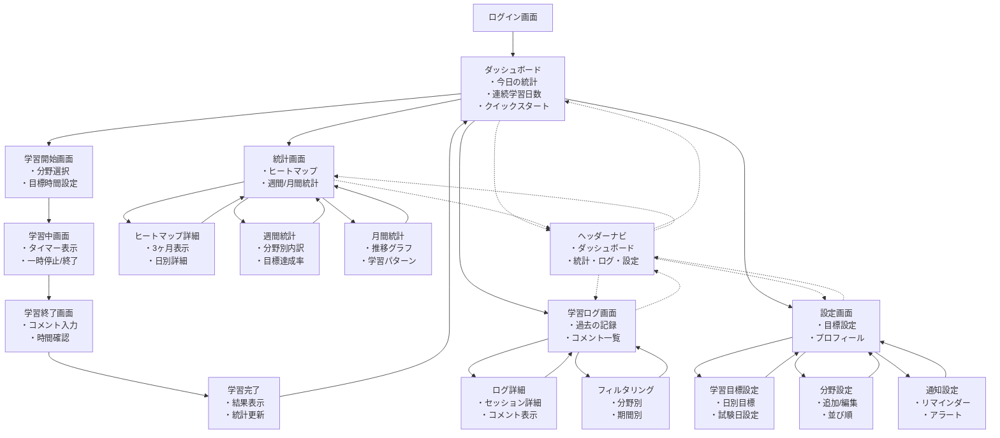

# 資格学習アプリ UI/UX設計仕様書

## 1. 設計概要

### 1.1 設計方針
- **モバイルファースト**: スマートフォンでの利用を最優先
- **シンプル設計**: 2タップで学習開始できる直感的なUI
- **継続性重視**: GitHub風ヒートマップによる視覚的モチベーション
- **記録重視**: 学習コメントによる振り返りと成長実感

### 1.2 ターゲットユーザー
- 資格取得を目指す社会人・学生
- 学習継続に課題を感じている人
- 進捗を可視化して達成感を得たい人

## 2. 画面遷移設計

### 2.1 全体の画面遷移図



### 2.2 主要画面の役割

#### 2.2.1 ダッシュボード（メイン画面）
- **目的**: 学習状況の一目での把握と学習開始への導線
- **主要コンテンツ**:
  - 今日の学習統計（時間・回数）
  - 連続学習日数の表示
  - クイックスタートボタン（最後に学習した分野で開始）
  - 最近の学習分野
  - 今日の目標達成率
- **遷移**: 全ての機能へのハブとして機能

#### 2.2.2 学習セッション系画面
```
学習開始 → 学習中 → 学習終了 → 完了 → ダッシュボード
```

**学習開始画面**:
- 分野選択（プルダウン）
- 目標時間設定（任意）
- 開始ボタン

**学習中画面**:
- 大きなタイマー表示
- 経過時間
- 一時停止ボタン
- 終了ボタン
- 画面ロック防止

**学習終了画面**:
- 学習時間の表示
- 学習コメント入力（必須）
- 分野の再確認
- 保存ボタン

**完了画面**:
- 今回の学習結果
- 今日の累計更新
- 激励メッセージ
- ダッシュボードに戻るボタン

#### 2.2.3 分析系画面

**統計画面**:
- GitHub風ヒートマップ（メイン）
- 週間統計へのリンク
- 月間統計へのリンク

**学習ログ画面**:
- 時系列の学習記録
- 学習コメント一覧
- フィルタリング機能

## 3. UXデザインのポイント

### 3.1 ユーザーフロー最適化

#### 最重要フロー: 学習開始
```
ダッシュボード → 学習開始 → 学習中 → 完了
（2タップで開始、シンプルな操作）
```

#### 学習継続のための仕掛け
- **視覚的フィードバック**: ヒートマップによる達成感
- **小さな成功体験**: 連続学習日数のカウント
- **振り返り機能**: 学習コメントによる成長実感

### 3.2 操作性の配慮

#### タップターゲット
- ボタンサイズ: 最小44px×44px
- 学習開始ボタン: 特に大きく目立つデザイン
- よく使う機能: 親指の届きやすい位置

#### フィードバック
- ローディング状態の表示
- 操作完了時のアニメーション
- エラー時の分かりやすいメッセージ

### 3.3 情報設計

#### 優先度の階層化
1. **🔥 最重要**: 学習開始ボタン
2. **📊 重要**: 今日の進捗
3. **📈 補完**: 統計・分析

#### 画面の情報密度
- ダッシュボード: 適度な情報量でスキャンしやすく
- 学習中画面: 必要最小限の情報のみ表示
- 統計画面: 情報豊富だが整理された表示

## 4. レスポンシブデザイン仕様

### 4.1 スマートフォン（375px〜）
- **学習中画面**: 画面ロック防止、縦画面固定
- **ナビゲーション**: ボトムナビゲーション
- **タイマー表示**: 画面の50%以上の大きさ
- **ボタン**: 親指操作に最適化

### 4.2 タブレット（768px〜）
- **統計画面**: 横画面で詳細データ表示
- **ヒートマップ**: 大画面を活用した見やすい表示
- **サイドナビゲーション**: 横幅を活用

### 4.3 デスクトップ（1024px〜）
- **2カラムレイアウト**: メインコンテンツとサイドバー
- **ダッシュボード**: 情報を並列表示
- **統計画面**: グラフや表を並べて表示

## 5. アクセシビリティ要件

### 5.1 基本要件
- **WCAG 2.1 AA準拠**を目標
- **カラーコントラスト**: 4.5:1以上
- **フォントサイズ**: 最小16px
- **キーボード操作**: 全機能をキーボードで操作可能

### 5.2 特別な配慮
- **色覚異常対応**: 色だけでなく形状・テキストで情報伝達
- **スクリーンリーダー対応**: 適切なラベル・見出し構造
- **フォーカス表示**: 明確なフォーカスインジケーター

## 6. パフォーマンス要件

### 6.1 表示速度
- **初期表示**: 2秒以内
- **画面遷移**: 0.5秒以内
- **タイマー更新**: リアルタイム（100ms間隔）

### 6.2 データ使用量
- **画像最適化**: WebP形式、適切な解像度
- **API呼び出し**: 必要最小限のデータ取得
- **キャッシュ活用**: 静的データのローカル保存

## 7. 次の設計ステップ

### 7.1 詳細画面設計の優先順位
1. **🎯 ダッシュボード画面**（最重要）
   - ワイヤーフレーム作成
   - コンポーネント設計
   
2. **▶️ 学習フロー画面**（メイン機能）
   - 開始→中→終了の詳細設計
   - タイマーUIの詳細
   
3. **📊 統計画面**（差別化機能）
   - ヒートマップの実装仕様
   - グラフ表示の詳細

### 7.2 プロトタイピング計画
- **低精度プロトタイプ**: 主要フローの確認
- **高精度プロトタイプ**: ユーザビリティテスト用
- **レスポンシブテスト**: 各デバイスでの動作確認

## 8. デザインシステム（今後定義予定）

### 8.1 定義が必要な要素
- カラーパレット
- タイポグラフィ
- アイコンセット
- ボタンスタイル
- フォームスタイル
- カードコンポーネント

### 8.2 Vue.jsコンポーネント設計
- 再利用可能なUIコンポーネント
- アトミックデザイン適用
- プロップス仕様
- イベント仕様 